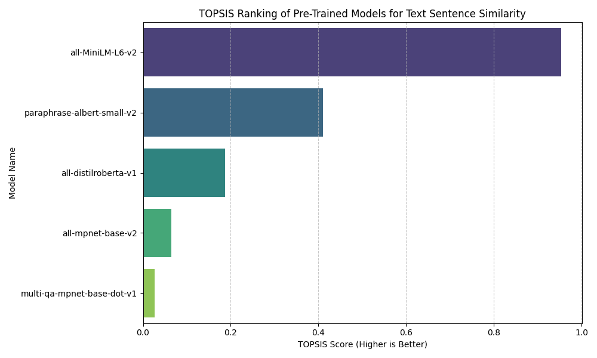

# TOPSIS-Based Selection of Best Pre-trained Model for Text Sentence Similarity

🔹 **Assigned Task:** Text Sentence Similarity  
🔹 **Method Used:** TOPSIS (Multi-Criteria Decision Making)

---

##  Objective
To rank multiple **pre-trained sentence embedding models** and determine the most suitable one for **Text Sentence Similarity** by considering multiple evaluation criteria such as:
- Semantic accuracy
- Inference speed
- Model size

---

##  Models Considered
The following pre-trained models were evaluated:

| Model Name |
|-----------|
| all-mpnet-base-v2 |
| all-MiniLM-L6-v2 |
| all-distilroberta-v1 |
| paraphrase-albert-small-v2 |
| multi-qa-mpnet-base-dot-v1 |

---

##  Decision Criteria
Three criteria were used to evaluate each model:

| Criterion | Description | Impact |
|---------|------------|--------|
| Cosine Similarity | Measures semantic similarity accuracy | Higher is better (+) |
| Inference Speed | Sentences processed per second | Higher is better (+) |
| Model Size (MB) | Storage requirement | Lower is better (-) |

---

##  Weights Assigned
Based on importance to sentence similarity tasks:

| Criterion | Weight |
|---------|--------|
| Cosine Similarity | 0.5 |
| Inference Speed | 0.3 |
| Model Size | 0.2 |

---

##  TOPSIS Methodology
The following steps were followed:

1. **Construction of Decision Matrix**
2. **Vector Normalization**
3. **Weight Assignment**
4. **Identification of Ideal Best and Ideal Worst**
5. **Calculation of Euclidean Distances**
6. **Computation of TOPSIS Score**
7. **Final Ranking of Models**

---

##  Implementation
The TOPSIS algorithm was implemented using **Python**, leveraging:
- `pandas`
- `numpy`
- `matplotlib`
- `seaborn`

The implementation calculates the TOPSIS score using the formula:
TOPSIS Score = S⁻ / (S⁺ + S⁻)

Where:
- `S⁺` = Distance from ideal best
- `S⁻` = Distance from ideal worst

---

##  Results

###  Final TOPSIS Ranking

| Rank | Model | TOPSIS Score |
|----|-----------------------------|-------------|
| 1 | all-MiniLM-L6-v2 | 0.9533 |
| 2 | paraphrase-albert-small-v2 | 0.4107 |
| 3 | all-distilroberta-v1 | 0.1867 |
| 4 | all-mpnet-base-v2 | 0.0648 |
| 5 | multi-qa-mpnet-base-dot-v1 | 0.0269 |

---

##  Best Model Selected
 **all-MiniLM-L6-v2**

### Reason:
- Excellent balance of **high semantic accuracy**
- **Very fast inference speed**
- **Compact model size**
- Achieves the **highest TOPSIS score**

---

##  Visualization
A bar chart was generated to visualize TOPSIS scores of all models.

